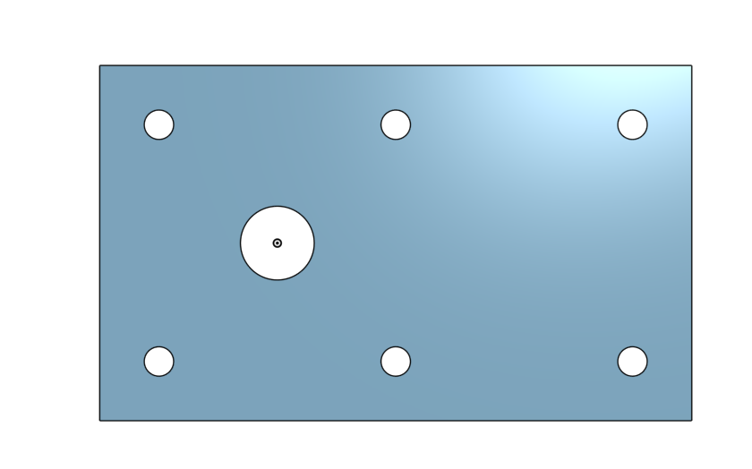
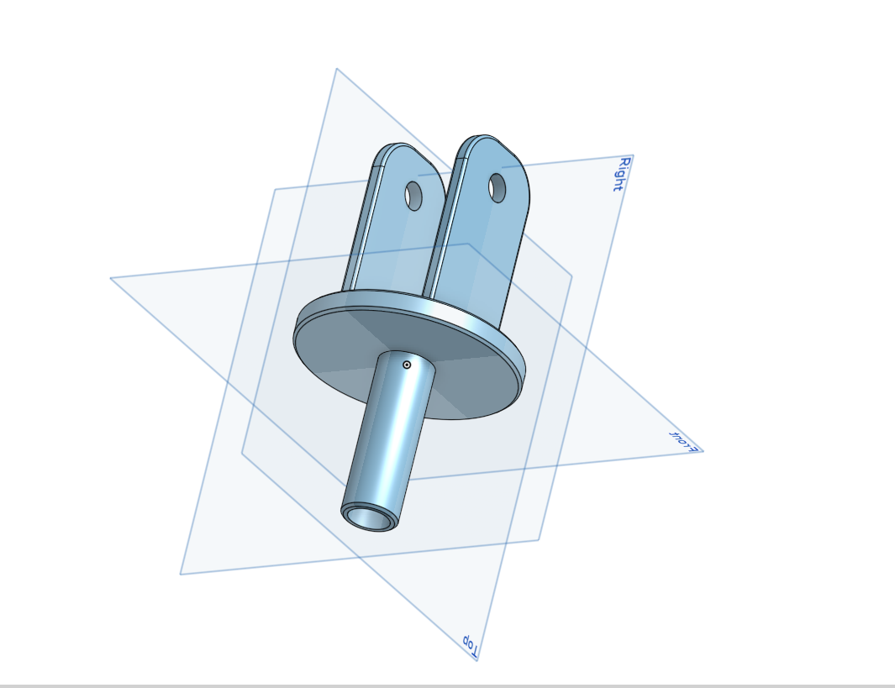

# BasicCAD

We are creating a caster.

---
## Table of Contents
* [Table of Contents](#Table-of-Contents)
* [Base](#Base)
* [Mount](#Mount)
* [Fork](#Fork)
* [Tire](#Tire)
* [Wheel](#Wheel)
* [AxleCollarBearings](#AxleCollarBearings)

## Base

### Description

The first assignment is to create the caster base.  The base's dimensions are 200 mm x 120 mm and 8 mm thick.  It has 6 holes 10 mm wide and 20 mm from the edge equally spaced along the edges.

### Evidence
[Pietro-The Base in Onshape](https://cvilleschools.onshape.com/documents/21da3990e30baedae950a0df/w/8a17235b57a33920783b2315/e/4b033c503785059520d84eaa)

### Image

### Reflection

Following along with the video made the assignment considerably easier. I would go, watch him perform a step, pause the video and do the step myself. My only worry is if I become to over dependent on his videos. I suppose we'll find out when we start doing independent projects. Once I got the hang of what we were doing it was a breeze, but before I got the hang of it it was tricky, and frustrating. 

Adding an image to my GitHub was very frustrating but with the help of Mr. Dierolf I got it done.

---

## Mount

### Description

I built a square with the sides being 120 mm. Then on each corner of the square I added a circle that was 20mm from the top and from the side of the square. The circumference of the circle was 10 mm. Then I added a centerpoint circle in the center of the square that was 20 mm in circumference.

### Evidence

[Pietro-Mount in Onshape](https://cvilleschools.onshape.com/documents/52f301d5da23997cc7f7fd9e/w/96173e67819940debf5b1400/e/22db9db6343c9e763d55bf4f)

### Image

### Reflection

This one was pretty easy and I finished it really quickly compared to "The Base." That may just be because "The Base" was the first one I did so I had less experience.

---

## Fork

### Description

Of all the ones we've done so far this one is definetly the hardest. We built something that kinda looks like the plug for an electrical device. It has a circular base, with two tongs coming out of one end. The tongs have circles on the end of them. On the other side of the circular base is a hollow cylender coming out of it.

### Evidence

[Pietro-Fork in Onshape](https://cvilleschools.onshape.com/documents/e22543b8e56e8cae94e9c4e1/w/7eb87ae05e98dd22c4641fee/e/595a33aa47254159e5db7707)

### Image

### Reflection

Even though this was the hardest/most complicated one we've had to do so far, I managed to do it the quickest. I've begun to memorize some of the keyboard shortcuts, I've had to pause the videos less, and I can build the shapes quicker. 

---

## Tire

### Description

### Evidence

### Image

### Reflection

---

## Wheel

### Description

### Evidence

### Image

### Reflection

---

## AxleCollarBearings

### Description

### Evidence

### Image

### Reflection

---
